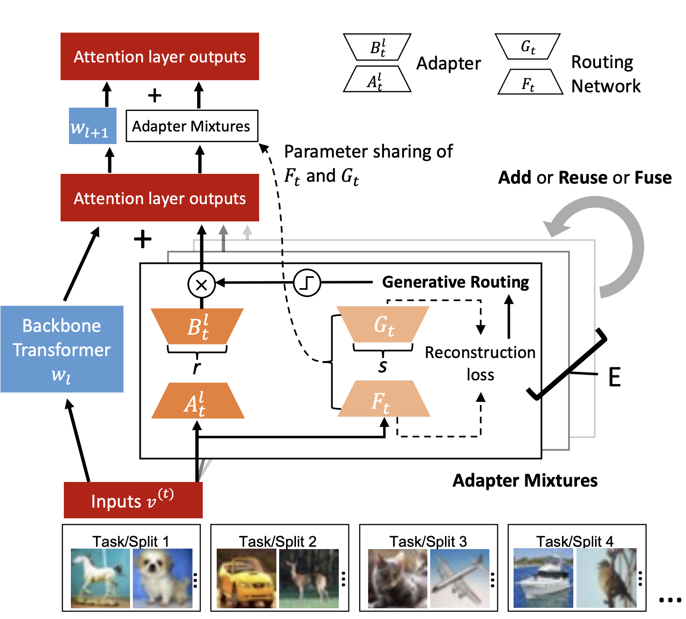

# Remembering Transformer
[](https://github.com/yaoyao-liu/class-incremental-learning/blob/master/LICENSE) [](https://www.python.org/) [](https://pytorch.org/) [](https://awesome.re)

The code repository for "Remembering Transformer for Continual Learning" [paper](https://arxiv.org/abs/2404.07518) in PyTorch. 

<p align="center">

</p>

## Training

### Split task
      python main_lora_pretrained_AE_lowdim_consolidation_retraining.py --task_type split --dataset cifar10 --num_task 5 --epochs 50 --seed 0
      
### Permutation task
      python main_lora_pretrained_AE_lowdim_consolidation_retraining.py --task_type permute --dataset mnist --num_task 20 --epochs 200 --seed 0

### Download Tiny Imagenet
      bash tinyimagenet_downloader.sh

## Citation
If this repository is helpful for your research or you want to refer the provided results in this work, you could cite the work using the following BibTeX entry:

```
@article{sun2024remembering,
  title={Remembering Transformer for Continual Learning},
  author={Sun, Yuwei and Sakuma, Jun and Kanai, Ryota},
  journal={arXiv preprint arXiv:2404.07518},
  year={2024}
}
```
